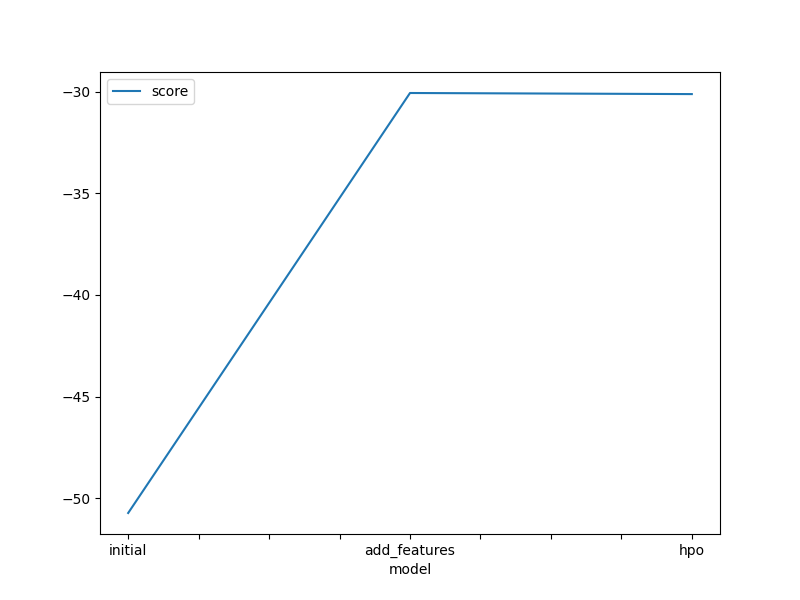
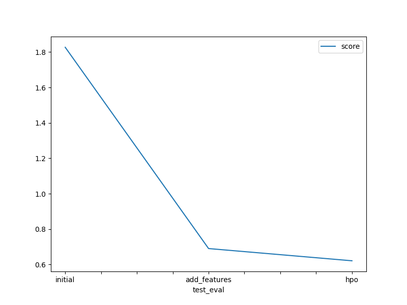

# Report: Predict Bike Sharing Demand with AutoGluon Solution
#### Amit Kumar Sharma

## Initial Training
### What did you realize when you tried to submit your predictions? What changes were needed to the output of the predictor to submit your results?

- When first time when I raw dataset without EDA (changing datetime data type) and feature engineering, the model didn't perform good. 
- The model also predicts *negative* predictions and Kaggle don't accept negative predictions so, I have to replace all the negative predictions to 0.

### What was the top ranked model that performed?

The top-ranked model was the *(new features with hyperparameters)* model named `WeightedEnsemble_L3`, with a validation RMSE score of **30.116940** and the best Kaggle score of **0.62147**.

## Exploratory data analysis and feature creation
### What did the exploratory analysis find and how did you add additional features?

- Transform the `season` and `weather` feature to categorical value which was previous read as `integer` in the raw dataset.
- *datetime* feature is parsed as datetime to get the new features i.e, `year`, `month`, `day`, `hour` and `dayofweek`

### How much better did your model preform after adding additional features and why do you think that is?

- After adding additional features, the model did better than initial model and improved by `260%`.

## Hyper parameter tuning
### How much better did your model preform after trying different hyper parameters?

- Hyperparameter tuning did not improve model performance by much.
- The model accuracy increases after the excluding some of the model that bot performing well previously and optimizing some of the model that did better.
- In most of the case, the model we get after feature engineering the best, even after the hyperparameter tunning.

### If you were given more time with this dataset, where do you think you would spend more time?

- I'd like to do more EDA and feature engineering, finding the features that are relevant and can increase accuracy more.
- Explore the different hyperparameters for increasing the model accuracy and the improve the performance of the model without losing the accuracy by much.

### Create a table with the models you ran, the hyperparameters modified, and the kaggle score.
|model|time_limit|num_bag_folds|hyperparameters|hyperparameter_tune_kwargs|score|
|--|--|--|--|--|--|
|initial|600|8|default|None|1.82719|
|add_features|600|8|default|None|0.69048|
|hpo|900|7|custom (GBM, CAT, XGB, XT), default (KNN)|num_trails: 3, scheduler: local, searcher: random|0.62147|

### Create a line plot showing the top model score for the three (or more) training runs during the project.

### Create a line plot showing the top kaggle score for the three (or more) prediction submissions during the project.

## Summary

- Through this project, I was able to apply all the concepts I have learned during the course.
- I used **AutoGluon**, an AutoML frameworks for training the ensembled regression model using the dataset of the bike sharing demand prediction project.
- By EDA and featuring engineering in the raw dataset, the initial AutoGluon model accuracy was improved significant factor.
- Additionally, the tunning the hyperparameter of AutoGluon `fit` method, increases the model accuracy and also used for improving the inference speed of the model.
- In conclusion, by completing this project I was able understand and apply all the necessary the steps/operations that are needed to create the real world ML models.